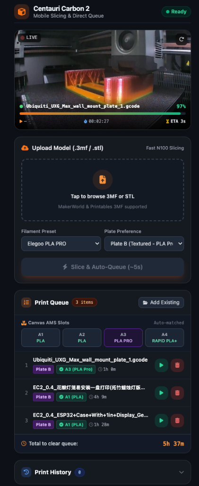

# Elegoo CC2 Headless Slicer & Mobile Print Kiosk

[](https://github.com/joekwong-uk/elegoo-cc2-addons)
[](https://www.elegoo.com)
[](https://github.com/OrcaSlicer/OrcaSlicer)
[-purple.svg)](https://github.com/joekwong-uk/elegoo-cc2-addons)
[](LICENSE)

A dedicated Home Assistant Add-on repository turning your **Elegoo Centauri Carbon 2 (CC2)** and Home Assistant instance into an autonomous, mobile-first 3D printing station with headless OrcaSlicer, live chamber camera telemetry HUD, Canvas AMS slot validation, and multi-job queue management.

<p align="center">
  <a href="https://my.home-assistant.io/redirect/supervisor_add_addon_repository/?repository_url=https%3A%2F%2Fgithub.com%2Fjoekwong-uk%2Felegoo-cc2-addons" target="_blank">
    
  </a>
</p>

---

<p align="center">
  
  <br>
  <em>Live Camera HUD Overlay, Auto Server Slicing, Dynamic Canvas AMS Matching, and Multi-Job Queue with Total Clearance Time</em>
</p>

---

## 💡 The Pain Points: Why This Add-on Exists

Desktop 3D printing workflows have not kept up with mobile smart homes:

1. **The "Desktop Computer Bottleneck":**
   You find an awesome model on MakerWorld, Printables, or Thingiverse while browsing on your phone or tablet. In the stock workflow, you must get up, turn on a PC, open desktop OrcaSlicer or Elegoo Slicer, import the file, slice it, and transfer it.
   > **Our Solution:** Download the `.3mf` or `.stl` on your phone, open your Home Assistant mobile app, tap upload, and your home server slices it in ~5 seconds with automated tree supports and pushes it straight to printer storage.

2. **The "Blind Filament" & Plate Mismatch Problem:**
   Stock slicer automation often blindly picks **Slot A1** (usually standard PLA) regardless of design specifications. If a model requires **PLA Pro**, **PETG**, or **ABS** on a textured PEI plate (**Plate A**), printing on smooth **Plate B** with regular PLA leads to ruined prints, bed adhesion failure, or plate damage.
   > **Our Solution:** A pre-print confirmation modal that inspects your live Canvas AMS slots (A1–A4). When PLA Pro is requested, it automatically enforces **Plate A (Textured PEI)** and selects the matching AMS slot with proactive compatibility warnings.

3. **Lack of a Persistent Multi-Job Queue with Cumulative Time:**
   The stock printer interface only handles one job at a time. When organizing a multi-part project or batch of prints, you have no way to queue 4 files, check individual durations, and see cumulative time to clear the entire plate backlog.
   > **Our Solution:** A persistent multi-job queue displaying individual job ETAs, material requirements, and **Total time to clear queue** (e.g., *5h 37m* across all queued items). After starting, jobs automatically archive to a persistent print history.

4. **Raw Camera Streams Lack Context:**
   Standard Home Assistant camera cards show a passive video feed without telemetry. You cannot tell what file is printing, how long it has been running, or when it will finish without switching dashboards.
   > **Our Solution:** Broadcast-style **Chamber Camera HUD overlay** positioned right over the live video feed showing active filename, real-time progress bar, started timestamp, elapsed timer (`HH:MM:SS`), and live remaining ETA.

5. **Eliminating Fragile Portainer / Docker Setups:**
   Running standalone Docker microservices on Home Assistant OS hosts triggers ADR-0014 unsupported/unhealthy warnings and lacks native authentication.
   > **Our Solution:** Packaged as a clean, compliant Home Assistant Add-on with native Ingress, automatic lifecycle management, and zero host contamination.

---

## 💻 Hardware Requirements & Performance Baseline

### What is an "N100"?
You might see references to an **"N100"** throughout this project. The **Intel Processor N100** is a modern 4-core, 4-thread x86_64 low-power CPU (6W–15W TDP) commonly found in affordable mini PCs (such as Beelink, Minisforum, GMKtec, or generic micro servers) widely used as dedicated Home Assistant OS hosts.

### Why Hardware Matters for Slicing
Unlike lightweight home automation integrations that simply read sensors, this add-on executes a complete, full-fledged geometry compilation engine (**OrcaSlicer Linux CLI**). Slicing mathematically decomposes complex 3D meshes (often millions of triangles) into hundreds of thousands of G-code toolpaths, calculates volumetric speed limits, and generates adaptive tree supports directly on the host CPU.

### Performance Comparison Matrix

| Host Hardware Tier | CPU Example | Typical Slicing Time | Experience |
|---|---|---|---|
| **High Performance** | Intel Core i5/i7/i9, AMD Ryzen 5000/7000+ | **~2 – 4 seconds** | ⚡ Instantaneous slicing |
| **Recommended Baseline** | **Intel N100 / N95 / N200 / N305** | **~4 – 8 seconds** | 🚀 Smooth, near-instant "phone-to-bed" flow |
| **Previous Gen Mini PCs** | Intel Celeron J4125 / N5105 / J1900 | **~15 – 30 seconds** | ⏱️ Fully functional, slight waiting period |
| **Raspberry Pi 4 / 5 (ARM)** | BCM2711 / BCM2712 | *Not Supported* | ❌ Requires x86_64 architecture |

### Minimum System Specifications
- **Architecture:** `amd64` (x86_64) only.
  *(ARM64 SBCs like Raspberry Pi are not supported because the upstream OrcaSlicer Linux AppImage is distributed exclusively for x86_64).*
- **CPU:** 64-bit x86_64 processor with at least 4 cores.
- **RAM:**
  - **Minimum:** 4 GB host RAM (with at least ~1.5 GB free during slicing).
  - **Recommended:** 8 GB or 16 GB host RAM (prevents out-of-memory errors when slicing high-polygon multi-plate 3MF files).
- **Disk Storage:** At least **2.5 GB** free disk space on your Home Assistant drive for the Docker image (OrcaSlicer AppImage, OpenGL/Mesa libraries, xvfb virtual framebuffer, and temporary G-code buffer).

---

## ✨ Features

- **🚀 Headless OrcaSlicer v2.4.2 Engine:** Slices 3MF & STL models on the fly using headless Linux OrcaSlicer CLI with virtual X11 (`xvfb-run`).
- **📹 Live Chamber Camera HUD:** High-framerate stream from port 8080 with dynamic HUD overlay (filename, elapsed timer, start timestamp, remaining ETA, progress bar).
- **🖼️ 3D Model Object Preview:** Automatically extracts embedded 3MF thumbnails (144x144 and 300x300) and injects them into G-code for CC2 touchscreen and kiosk display.
- **🎨 Canvas AMS Dynamic Matching:** Integrates with Home Assistant sensors to read loaded spool types and colors across slots A1–A4 in real-time.
- **🛡️ Plate Type & PLA Pro Safeguard:** Interactive selection between Textured Plate A and Smooth Plate B with automated material recommendations.
- **📋 Multi-Job Queue Management:** Auto-queues sliced models or adds existing `.gcode` files from CC2 eMMC storage, displaying individual job durations and total queue clearance time.
- **📜 Persistent Print History:** Stores completed and active print history in `/config/cc2_print_history.json` across reboots.
- **🔒 Passcode-Protected LAN Mode:** Fully compatible with Elegoo CC2 LAN mode passcode security.

---

## 📦 Installation in Home Assistant

### Option 1: 1-Click Easy Installation
Click this button to open your Home Assistant instance and automatically add this add-on repository:

[](https://my.home-assistant.io/redirect/supervisor_add_addon_repository/?repository_url=https%3A%2F%2Fgithub.com%2Fjoekwong-uk%2Felegoo-cc2-addons)

---

### Option 2: Manual Installation
1. In Home Assistant, navigate to **Settings** -> **Add-ons** -> **Add-on Store**.
2. Click the three dots (⋮) in the top-right corner and select **Repositories**.
3. Add the repository URL:
   ```text
   https://github.com/joekwong-uk/elegoo-cc2-addons
   ```
4. Click **Add**, then close the dialog.
5. Search for **Elegoo CC2 Headless Slicer & Kiosk** in the Add-on Store.
6. Click **Install**.
7. Go to the **Configuration** tab and set your printer details:
   ```yaml
   printer_ip: "192.168.1.100"   # Replace with your Centauri Carbon 2 local IP
   access_code: "000000"        # Replace with your 6-digit access code from printer LAN settings
   ```
8. Click **Start** and enable **Watchdog** and **Show in sidebar**.

---

## 📱 Adding the Mobile Kiosk to your Lovelace Dashboard

To display the full-screen kiosk in your Home Assistant dashboard, add an iframe panel view in your dashboard configuration:

```yaml
title: 3D Printer
views:
  - title: 3D Printer
    path: kiosk
    panel: true
    cards:
      - type: iframe
        url: /local/cc2_kiosk/index.html
        aspect_ratio: 100%
```

*(Or access it directly from the Home Assistant sidebar via Ingress!)*

---

## 🛠️ REST API Reference

The add-on service listens on port `8765` (and routes via Home Assistant Ingress):

| Endpoint | Method | Description |
|---|---|---|
| `/api/status` | `GET` | Microservice health check & printer connection status |
| `/api/upload` | `POST` | Multipart upload for `.3mf` / `.stl`, slices and uploads to CC2 |
| `/api/camera` | `GET` | Live MJPEG camera stream proxy with access code support |
| `/api/thumbnail` | `GET` | Retrieves cached 3D model thumbnail preview |
| `/api/print/status` | `GET` | Real-time telemetry (active job, elapsed/remaining time, %) |
| `/api/queue` | `GET` | Returns queued jobs, per-job ETAs, and total queue clearance time |
| `/api/queue` | `POST` | Queue operations (`add`, `delete`, `reorder`, `start_next`, `clear`) |
| `/api/print/confirm_start` | `POST` | Validates Plate A/B & AMS slot, moves job to history, and starts print |
| `/api/history` | `GET` | Persistent history of recent completed and printing jobs |
| `/api/files` | `GET` | Lists all `.gcode` files stored on the printer's internal eMMC |

---

## 📄 License
MIT License. OrcaSlicer is licensed under AGPL-3.0.
All trademarks belong to their respective owners (Elegoo, OrcaSlicer, Home Assistant).
